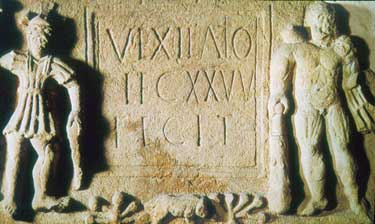

# *Centuria* - eine taktische Simulation zur römischen Armee der frühen Kaiserzeit
- Autor: Jorit Wintjes
- Geschrieben: ?
- Getestet: ?

## 1. Einleitung

### 1.1. Allgemeines
Bei *Centuria* handelt es sich um eine taktische Simulation des Einsatzes von Einheiten der früh- und hochkaiserzeitlichen römischen Armee.

### 1.2. Maßstab
Die kleinste taktisch operationalisierbare Einheit im *Centuria*-Regelwerk ist die Zenturie, also eine Einheit von rund 80 Infanteristen. Andere Einheiten sind ungefähr diesem Maßstab angepaßt, Führungsfiguren mit Sonderaufgaben sind einzeln bewegbar.

### 1.3. Kartengestaltung
*Centuria* liegt eine Hexfeldkarte zugrunde, die grundlegenden Regelmechanismen lassen sich aber auch auf andere Kartenformen, ggf. unter Zuhilfenahme einer Meßhilfe, anwenden.

## 2. Allgemeiner Ablauf

### 2.1. Allgemeines
Bei *Centuria* handelt es sich um eine rundenbasierte Simulation. Für die Durchführung einer Runde steht den Teilnehmern nur ein begrenzter Zeitraum zu Verfügung, der dem jeweiligen Szenario anzupassen ist.
### 2.2. Ablauf einer Runde
Jede Runde gliedert sich ein zwei Phasen, eine Bewegungsphase und eine Kampfphase. In der Bewegungsphase können Einheiten gemäß den Regeln bewegt, in der Kampfphase eingesetzt werden.

## 3. Bewegung

### 3.1. Allgemeines
Einheiten werden gemäß des Bewegungswertes der Einheit (zu- oder abzüglich möglicher Modifikatoren, siehe Tabellenteil) bewegt.

### 3.2. Kommandoreichweite
Teileinheiten müssen sich bei Beginn einer Bewegung innerhalb der Kommandoreichweite des Anführers befinden. Zudem müssen Teileinheiten eine Sichtverbindung zu ihrem Anführer besitzen oder mit einer Teileinheit mit Sichtverbindung in direktem Kontakt stehen.

### 3.3. Orientierung
Jede Einheit besitzt eine Orientierung, die Auswirkungen auf die Kampfwerte haben kann. Ein Wechsel der Orientierung ("Drehen") zur Seite kostet einen Bewegungspunkt, eine Wendung nach hinten zwei Bewegungspunkte

## 4. Kampf

### 4.1. Allgemeines
Eine Teileinheit kann nur innerhalb der Kommandoreichweite des Anführers einen Angriff einleiten. Dabei laufen Angriff und Verteidigung theoretisch – gleichzeitig ab; es wird gegen die Summe aus Angriffs- und Verteidigungswert der angreifenden und verteidigenden Einheiten gewürfelt (siehe Tabellenteil), ein Ergebnis größer als die Summe wird als Erfolg gewertet, die betroffene Einheit herausgenommen. Wenn sowohl Angriffswurf als auch Verteidigungswurf erfolgreich sind, werden beide Einheiten herausgenommen.

### 4.2. Einfluß v. Orientierung
Die Orientierung einer Teileinheit wirkt sich auf das Kampfgeschehen aus. Ein Angriff auf eine Seite mindert den Verteidigungwert um 2 (-2), ein Angriff in den Rücken um 4 (-4).

###  4.3. Einfluß v. Moral
Zum Einfluß v. Moral siehe die Moralregeln.

## 5. Kommandostruktur

### 5.1. Allgemeines
Teileinheiten können nur innerhalb der Kommandoreichweite von Führungsfiguren operationalisiert werden. Einheiten können sich aus der Kommandoreichweite ihrer Führungsfigur herausbewegen, außerhalb der Kommandoreichweite von Führungsfiguren befindliche Teileinheiten können sich jedoch nicht mehr bewegen oder angreifen. Sie können jedoch ihre Orientierung ändern, sich verteidigen oder fliehen

### 5.2. Kommandoreichweite
Die Kommandoreichweite ist sowohl durch den entsprechenden Wert der Führungsfigur als auch durch die Sichtweite definiert; Teileinheiten, die zwar innerhalb der Kommandoreichweite aber außer Sicht befindlich sind, können nicht operationalisiert werden.

**Ausnahme:**	Ist eine Teileinheit durch eine benachbarte Teileinheit mit einer anderen Teileinheit innerhalb der Kommandoreichweite einer Führungsfigur verbunden, kann diese in gleicher Weise wie die anderen Einheiten operationalisiert werden.

## 6. Moralregeln

### 6.1. Allgemeines
Moraltests sind durchzuführen:
1. durch die **verbliebenen Teileinheiten**, wenn mehr als 50% der Teileinheiten ausgefallen sind (Führungsfiguren sind hiervon ausgenommen).
2. durch diejenigen Teileinheiten, die sich **außerhalb der Kommandoreichweite** des neuen Anführers befinden, wenn der Anführer fällt und ein Ersatz in Form eines subpraefectus oder eines tribunus verfügbar ist.
3. durch alle Teileinheiten, wenn der Anführer fällt und kein Ersatz verfügbar ist.

### 6.2. Durchführung von Moraltests
Moraltests sind Einheitenweise durchzuführen. Es wird für jede einzelne Teileinheit gegen den Moralwert gewürfelt. Dabei sind etwaige Boni von Führungsfiguren zu beachten (siehe Tabellenteil), außerdem bietet jede unmittelbar nebenstehende Einheit mit intakter Moral einen Moralbonus von +1.

### 6.3. Mögliche Ergebnisse von Moraltests
1. Wenn Moraltest erfolgreich ist, kann die Einheit normal eingesetzt werden
2. scheitert der Moraltest, bleibt die Einheit untätig stehen und wird markiert; Modifikator Angriff (für Gegenangriff) +2
3. scheitert ein erneuter Moraltest bei einer Einheit, beginnt diese sich aufzulösen und wird erneut markiert; Modifikatoren Angriff (für Gegenangriff) +4, Verteidigung -4
4. scheitert ein erneuter Moraltest bei einer Einheit in Auflösung, wendet sich diese zur Flucht und bewegt sich rückwärts, soweit dies gemäß den Bewegungsregeln möglich ist; jede Einheit, mit der die flüchtende Einheit in Kontakt tritt, muß einen Moraltest durchführen

## 7. Sonstige Regeln

### 7.1. Artillerieeinsatz
1. Das Ziel muß von einer eigenen Einheit gesehen werden, die entweder mit ballista/tormentum in direktem Kontakt steht oder sich in Sichtlinie befindet.
2. Bei Würfelergebnis von 1 fällt das Waffensystem zeitweilig aus; ein Moraltest ist notwendig.
3. Das tormentum kann indirekt feuern, die ballista nicht.

## 8. Tabellenteil

### 8.1.Einheitenwerte Römische Armee

|Einheit		|Bewegung|Aktionsradius|Angriff|Verteidigung|Moral|
|:----------|--------|-------------|-------|------------|-----|
|*centuria*	 |2		 |1				 |6		|9				  |10   |
|*turma*		 |4		 |1				 |7		|8				  |12   |
|*singulares*|4		 |1				 |6		|8				  |6   |
|*evocati*	 |2		 |1				 |5		|10			  |5   |
|*ballista*	 |1		 |5				 |6		|4				  |14   |
|*tormentum* |1		 |6				 |4		|4				  |14   |
|*legatus*	 |3		 |3				 |17		|2				  |3   |
|*tribunus*	 |3		 |2				 |17		|2				  |4   |
|*praefectus coh*	|2	 |3				 |17		|2				  |4   |
|*praefectus alae*|4 |3				 |17		|2				  |4   |
|*subpraefectus*	|2/4|2				 |17		|2				  |4   |
|*centurio ballista*	 |2		 |2				 |17		|2				  |4   |

### 8.2. Boni

|Einheit   |Angriff|Verteidigung|Moral|
|:---------|-------|------------|-----|
|*legatus* |-2     |+1          |-4   |
|*tribunus*|-1     |+1          |-2   |
|*preafectus coh*|-1|+1         |-3   |
|*praefectus alae*|-1|+1        |-3   |
|*subpraefectus*|-1|+1          |-2   |
|*centurio ballista**|-|-      |-1   |
* *ballista* u. *tormentum* schießen zweimal

### 8.3. Gelände

|Gelände|Einheit|Angriff|Verteidigung|Bewegung|Sichthindernis|
|:------|:------|:-----:|:----------:|:------:|--------------|
|Gras   |*centuria*   |-|-           |-       |nein          |
|       |*evocati*    |-|-           |-       |nein          |
|       |*singulares* |-|-           |-       |nein          |
|       |*turma*      |-|-           |-       |nein          |
|       |*ballista*   |-|-           |-       |nein          |
|       |*tormentum*  |-|-           |-       |nein          |
|Acker  |*centuria*   |-|-           |-       |nein          |
|       |*evocati*    |-|-           |-       |nein          |
|       |*singulares* |-|-           |**-1**  |nein          |
|       |*turma*      |**+1**|**-1** |**-1**  |nein          |
|       |*ballista*   |-|-           |-       |nein          |
|       |*tormentum*  |-|-           |-       |nein          |
|Bäume  |*centuria*   |**+1**|**-1** |**-1**  |ja            |
|       |*evocati*    |-|-           |**-1**  |ja            |
|       |*singulares* |**+1**|**-1** |**-2**  |ja            |
|       |*turma*      |**+3**|**-2** |**-3**  |ja            |
|       |*ballista*   |**+3**|-      |-       |ja            |
|       |*tormentum*  |**+3**|-      |-       |ja           |
|Straße |*centuria*   |-|-           |-       |nein          |
|       |*evocati*    |-|-           |-       |nein          |
|       |*singulares* |-|-           |-       |nein          |
|       |*turma*      |-|-           |-       |nein          |
|       |*ballista* (Ziel)|**-1**|**-1**|-    |nein          |
|       |*tormentum* (Ziel)|**-1**|**-2**|-   |nein          |
|Weg    |*centuria*   |-|-           |-       |nein          |
|       |*evocati*    |-|-           |-       |nein          |
|       |*singulares* |-|-           |-       |nein          |
|       |*turma*      |-|-           |-       |nein          |
|       |*ballista*   |-|-           |-       |nein          |
|       |*tormentum*  |-|-           |-       |nein          |
|Gebäude|*centuria*   |-|**+2**      |**-1**  |ja            |
|       |*evocati*    |-|**+2**      |**-1**  |ja            |
|       |*singulares* |**+2**|**-2** |**-3**  |ja            |
|       |*turma*      |**+3**|**-3** |**-3**  |ja            |
|       |*ballista*   |**+3**|-      |**-1**  |ja            |
|       |*tormentum*  |**+3**|-      |**-1**  |ja            |