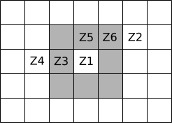
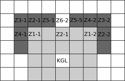
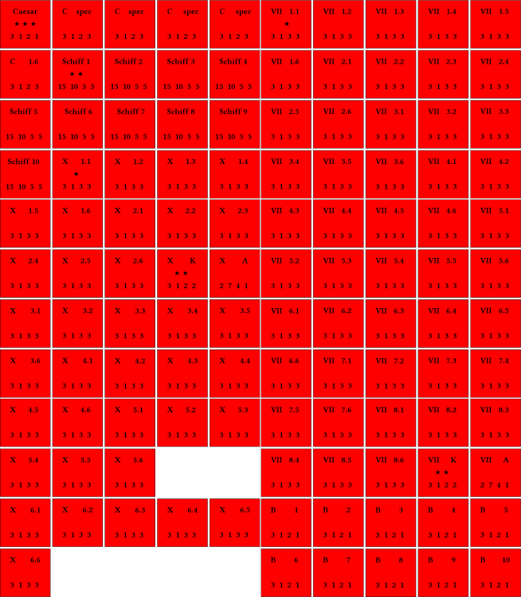

# Simulation „D-Day 55 v. Chr.“ - Regelwerk
- Autor: Jorit Wintjes 
- Entwickelt: ?
- Getestet: ?

## I. Allgemeines

**I.1.**	Bei „D-Day 55 v. Chr.“ handelt es sich um ein Simulationsregelwerk zur ersten Landung Caesars in Britannien im Jahr 55 v. Chr. Im Mittelpunkt stehen dabei die koordinativen Probleme einer amphibischen Großoperation; auf eine detaillierte Abbildung des Kampfgeschehens wird daher bewusst verzichtet.

**I.2.**	Grundlage der Rekonstruktion bildet – neben allgemeinen Informationen zum römischen Militärwesen der späten Republik – in erste Linie die Beschreibung der Invasion durch Caesar in BG 4.20-38, insbesondere die Kap. 21-26.

## II. Bewegungsregeln

**II.1.**	Den einzelnen Einheiten sind verschiedene Bewegungswerte zugeordnet; siehe hierzu die Einheitenliste.

**II.2.**	Wesentliche Auswirkung auf die tatsächliche Bewegung einer Einheit haben Terrain bzw. Untergrund:

|Terrain|Auswirkung auf Bewegungswert|
|-------|----------------------------|
|Grasfläche, eben|keine              |
|Kieselstrand|- 1									 |
|Abhang (Hügel)|- 1 (nur aufwärts)   |
|Flachwasserzone A|- 2               |
|Flachwasserzone B|- 5	               |

## III. Kommandoregeln

**III.1.**	Ein wesentliches Ziel von „D-Day 55 v. Chr.“ ist die wenigstens ansatzweise Abbildung von Kommandostrukturen innerhalb der römischen Armee bzw. des britischen Kontingents. Der hierfür verwendete Mechanismus ist der „Kommandobereich“, ein Bereich, innerhalb dessen alle einer jeweiligen Führungseinheit zugeordneten Teileinheiten von dieser Befehle empfangen und ausführen können.

**III.2.**	Abhängig von ihrer Rangstellung sind den einzelnen Führungseinheiten unterschiedliche Kommandobereiche zugewiesen:

|Führungseinheit|Kommandobereich|
|---------------|---------------|
|Kohorte (Zenturie 1)|         1|
|Kommandogruppe Legion|        2|
|Caesar|                       3|
|Anführer Briten|2 (nur für eigene Tr.!)|
|Gefolge (Wagen/Reiter)|1 (nur für eigene Tr.!)|

**III.3.**	Die Kommandobereiche erstrecken sich von der Führungseinheit ausgehend in jede Richtung; im folgenden Beispiel einer Kohorte (Führungseinheit Zenturie 1) sind die Zenturien 3, 5, 6 innerhalb des Kommandobereichs, die Zenturien 2 und 4 hingegen nicht.

Über die Verkettung von Führungseinheiten lassen sich größere Bewegungen koordiniert vollziehen; im folgenden Beispiel befinden sich zwei Führungseinheiten (Zenturie 1-1, Zenturie 1-2) im Kommandobereich der Kommandogruppe Legion. Mit Ausnahme von Zenturie 6-2 können alle Einheiten erfaßt werden, Zenturie 2-1 ist dabei direkt der Kommandogruppe Legion unterstellt.

**III.4.**	Einheiten außerhalb des Kommandobereiches der ihr zugewiesenen Führungseinheit können ein unter Umständen mißliches Verhalten an den Tag legen, sofern dies nicht durch eine übergeordnete Führungseinheit unterbunden wird.

- **III.4.a.**	Einheiten suchen automatisch im Rahmen ihrer Bewegungsmöglichkeiten der nächsten Einheit zu ihrer Rechten Anschluß.

- **III.4.b.**	Einheiten greifen automatisch im Rahmen ihrer Bewegungsmöglichkeiten Einheiten mit niedrigeren Moralwerten an.

- **III.4.c.**	Einheiten reagieren auf den Verlust einer nebenstehenden Einheit mit Rückzug im Rahmen ihrer Bewegungsmöglichkeiten bzw. nach gescheitertem Moraltest mit Flucht (siehe III.5. und III.6.).

**III.5.**	Bei Verlust einer Führungseinheit müssen sich alle Einheiten des Kommandobereiches einem Moraltest (5/6 auf W6; Moralwert bestimmt Würfelanzahl) unterziehen:

|Erfolge|Resultat|
|-------|--------|
|3| Sturmangriff!|
|2|Verharren in Position|
|1|geordneter Rückzug|
|-|        Flucht|

**III.6.**	Bei geordnetem Rückzug bewegen sich die betroffenen Einheiten einmal in eine feinabgewandte Richtung und verharren dann in Position; fliehende Einheiten bewegen sich solange nach hinten, bis sie von einer Führungseinheit zu einem erneuten Moraltest veranlaßt werden und diesen bestehen. Gleichzeitig veranlassen fliehende Einheiten mit einer Reichweite von 1 andere Einheiten, auch wenn diese im Kommandobereich einer Führungseinheit befindlich sind, zu einem Moraltest - und können so aus einem lokalen Fluchtereignis unter Umständen eine frontweite Panik entstehen lassen. Nach dem dritten gescheiterten Moraltest löst sich die betreffende Einheit auf.

## IV. Kräfteverteilung

### 1. Römer

|Kontingent|Qualität|Einheiten|
|:----------|:--------|:---------|
|**Caesar**			|★★★ 	|Caesar, 5 Einheiten *speculatores* **[‡]**						|
|***legio x***		|★★		|Kommandogruppe [‡], 8 Kohorten je 6 Zenturien = 24 Zenturien Infanterie [†]|
|***legio x***		|★		|8 Kohorten je 6 Zenturien = 24 Zenturien Infanterie [†], Artilleriegruppe [†]|
|***legio vii***	|★		|Kommandogruppe [†], 8 Kohorten je 6 Zenturien = 24 Zenturien Infanterie [†]|
|***legio vii***	|★		|8 Kohorten je 6 Zenturien = 24 Zenturien Infanterie [†], Artilleriegruppe [†]|
|**Kriegsschiffe**|★★|10 Kriegsschiffe (Artillerie) [†], 10 Einheiten überzählige Besatzungen|
|**Gesamt:**|	|Caesar, 5 Einheiten *speculatores*, 2 Kommandogruppen, 2 Artilleriegruppen, 96 Zenturien, 10 Kriegsschiffe, 10 Einheiten Besatzungen = **125 Einheiten**|

### 2. Briten

|Kontingent|Qualität|Einheiten|
|:----------|:--------|:---------|
|**Segovax**			|★		|Segovax, 10 Einheiten Gefolge (Wagen) [†], 35 Einheiten Fußtruppen|
|**Carvilius**		|★		|Carvilius, 5 Einheiten Gefolge (Reiter) [†], 15 Einheiten Fußtruppen|
|**Cingetorix**		|★		|Cingetorix, 7 Einheiten Gefolge (Wagen) [†], 25 Einheiten Fußtruppen|
|**Taximagulus**	|★		|Taximagulus, 7 Einheiten Gefolge (Reiter) [†], 30 Einheiten Fußtruppen|
|**Lugotorix**		|★		|Lugotorix, 3 Einheiten Gefolge (Wagen) [†], 15 Einheiten Fußtruppen|
|**Agr*+					|★		|Agr, 10 Einheiten pers. Gefolge (Reiter) [†], 15 Einheiten Reiter|
|**Gesamt:**			|			|Segovax, Carvilius, Cingetorix, Taximagulus, Lugotoris, Agr, 20 Einheiten Gefolge (Wagen), 22 Einheiten Gefolge (Reiter), 120 Einheiten Fußtruppen, 15 Einheiten Reiter = **177 Einheiten**|

## V. Ziele u. Siegvoraussetzungen

### 1. Römer

- **Gesamtpunkte:** 125 P. 
- **Verluste**
	- Speculatores: 5 P.
	- Kommandogruppe: 5 P.
	- Zenturie: 1 P.
	- Artilleriegruppe: 2 P.
	- Kriegsschiff: 2 P.
	- Besatzungen: ½ P.
- **Allgemeine Bestimmungen**
	- allgemeines Ziel: erfolgreiche Durchführung einer Landung mit danach weiterhin einsatzbereitem Verband
	- Siegvoraussetzung: Kontrolle der Höhen **A-G**
	- Tod Caesars führt zur automatischen Niederlage
	- römische Punktezahl wird insgesamt gewertet 
	- Punktezahl **>75** (Punktezahl **<75** wird als Niederlage gewertet)|

### 2. Briten

- **Gesamtpunkte**
	- Segovax: 75 P.
	- Carvilius: 30 P.
	- Cingetorix: 53 P.
	- Taximagulus: 58 P.
	- Lugotoris: 27 P.
	- Agr: 60 P.
- **Verluste**
	- Gefolge (Wagen): 5 P.
	- Gefolge (Reiter): 4 P.
	- Reiter: 2 P.
	- Fußtruppen: 1 P.
- **Allgemeine Bestimmungen**
	- allgemeines Ziel: erfolgreiche Verteidigung des Strandes
	- Siegvoraussetzung: Kontrolle der Höhen **A-G**
	- Tod eines Anführers führt zum Rückzug seines Kontingents
	- Punktezahl wird einzeln je Kontingent gewertet
	- Punktezahl <50% wird als Niederlage d. Kontingents gewertet

## VI. Einheitenliste

### 1. Römer

|Einheit|Bewegung|Reichweite|Angriff|Verteidigung|Moral|Bonus|
|:------|--------|----------|-------|------------|-----|-----|
|Caesar|3|1|2|3|3|+2/3I|
|*speculatores*|3|1|3|3|3|-|
|Kommandogruppe|3|1|2|2|3|+1|
|Zenturie|3|1|3|3|2+1|-|
|Artilleriegruppe|2|7|4|1|1+1|-|
|Kriegsschiff|15|10|5|5|2|-|
|Besatzung|3|1|2|1|1|-|

### 2. Briten

|Einheit|Bewegung|Reichweite|Angriff|Verteidigung|Moral|Bonus|
|:------|--------|----------|-------|------------|-----|-----|
|Anführer|3|1|2|1|3|+2/1I|
|Gefolge (Wagen)|5|2|3|2|3|-|
|Gefolge (Reiter)|6|1|2|2|3|-|
|Reiter|6|1|2|2|2|-|
|Fußtruppen|3|1|1|1|1|-|

## Anhang: Tokens  
### Römer
